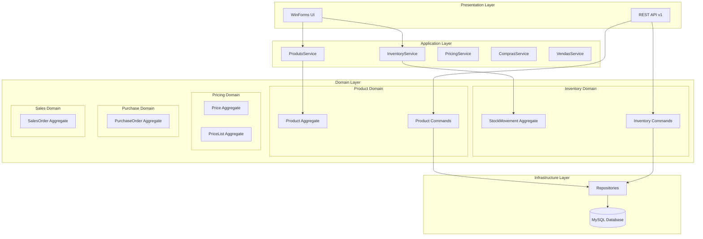

# Design Document

## Overview

Esta refatoração visa implementar uma separação clara de responsabilidades seguindo os princípios de Domain-Driven Design (DDD), separando o cadastro de produtos (dados mestres) das operações de estoque, preços, compras, vendas e financeiro. O sistema atual possui acoplamento inadequado onde o modelo `Produto` contém informações que pertencem a outros domínios.

A arquitetura proposta mantém a estrutura existente de Clean Architecture com camadas Domain, Infrastructure, API e Form, mas reorganiza as responsabilidades dentro de cada domínio específico.

## Architecture

### Current State Analysis

**Problemas Identificados:**
- Modelo `Produto` contém campos de estoque (`QuatidadeEstoqueProduto`), preços (`PrecoCusto`, `PrecoVenda`) e datas (`DataFabricao`, `DataVencimento`)
- Tela de cadastro mistura dados mestres com informações operacionais
- API endpoints não seguem padrão REST consistente
- Falta separação clara entre domínios

**Assets Existentes Aproveitáveis:**
- `StockMovement` já implementado corretamente
- `InventoryController` com estrutura adequada
- Sistema de autenticação e autorização funcional
- Infraestrutura de logging e observabilidade

### Target Architecture



## Components and Interfaces

### 1. Product Domain (Catalog)

**Responsabilidade:** Dados mestres do produto

**Modelo Refatorado:**
```csharp
public class Produto : EntityBase
{
    public string CodBarras { get; set; }
    public string NomeProduto { get; set; }
    public string DescricaoProduto { get; set; }
    public bool IsPerecivel { get; set; }  // Novo campo
    public virtual Fornecedor Fornecedor { get; set; }
    public Guid FornecedorId { get; set; }
    public virtual Categoria Categoria { get; set; }
    public Guid CategoriaId { get; set; }
    public int StatusAtivo { get; set; }
    
    // REMOVIDOS: PrecoCusto, PrecoVenda, MargemLucro, DataFabricao, 
    // DataVencimento, QuatidadeEstoqueProduto, MinimumStock, MaximumStock, ReorderPoint
}
```

**API Endpoints:**
```
POST   /api/v1/produto
PUT    /api/v1/produto/{id}
DELETE /api/v1/produto/{id}
GET    /api/v1/produto/paginated
GET    /api/v1/produto/{id}
GET    /api/v1/produto/barcode/{codigo}
```

### 2. Inventory Domain

**Responsabilidade:** Controle de estoque através de movimentações

**Modelos Existentes (Manter):**
- `StockMovement` - já implementado corretamente
- `StockMovementType` - enum já adequado

**Novos Modelos:**
```csharp
public class InventoryBalance : EntityBase
{
    public Guid ProdutoId { get; set; }
    public decimal CurrentStock { get; set; }
    public decimal ReservedStock { get; set; }
    public decimal AvailableStock => CurrentStock - ReservedStock;
    public DateTime LastUpdated { get; set; }
    public decimal MinimumStock { get; set; }
    public decimal MaximumStock { get; set; }
    public decimal ReorderPoint { get; set; }
    public string? Location { get; set; }
}

public class StockMovementDetail : EntityBase
{
    public Guid StockMovementId { get; set; }
    public string? Lote { get; set; }
    public DateTime? DataValidade { get; set; }
    public decimal Quantity { get; set; }
}
```

**API Endpoints (Existentes - Melhorar):**
```
POST   /api/v1/inventory/movements
GET    /api/v1/inventory/movements
GET    /api/v1/inventory/stock/{productId}
GET    /api/v1/inventory/alerts
POST   /api/v1/inventory/validate-stock
```

### 3. Pricing Domain (Futuro)

**Responsabilidade:** Gestão de preços e políticas de preço

**Novos Modelos:**
```csharp
public class PriceList : EntityBase
{
    public string Name { get; set; }
    public string Description { get; set; }
    public DateTime ValidFrom { get; set; }
    public DateTime? ValidTo { get; set; }
    public bool IsActive { get; set; }
    public virtual ICollection<ProductPrice> ProductPrices { get; set; }
}

public class ProductPrice : EntityBase
{
    public Guid ProdutoId { get; set; }
    public Guid PriceListId { get; set; }
    public decimal CostPrice { get; set; }
    public decimal SalePrice { get; set; }
    public decimal Margin { get; set; }
    public DateTime ValidFrom { get; set; }
    public DateTime? ValidTo { get; set; }
}
```

### 4. Services Refatorados

**ProdutoService (Cliente):**
```csharp
public class ProdutoService
{
    // Apenas operações de dados mestres
    Task<PagedResult<ProdutoDto>> ListarPaginadoAsync(PaginationRequest request);
    Task<ProdutoDto> ObterPorIdAsync(Guid id);
    Task<ProdutoDto> ObterPorCodigoBarrasAsync(string codigo);
    Task<ApiResponse> AdicionarAsync(AdicionarProdutoRequest request);
    Task<ApiResponse> AlterarAsync(AlterarProdutoRequest request);
    Task<ApiResponse> RemoverAsync(Guid id);
}
```

**InventoryService (Cliente - Novo):**
```csharp
public class InventoryService
{
    Task<StockBalanceDto> ObterSaldoAsync(Guid productId);
    Task<PagedResult<StockMovementDto>> ListarMovimentosAsync(MovementFilterRequest request);
    Task<ApiResponse> CriarMovimentoAsync(CreateMovementRequest request);
    Task<StockValidationResult> ValidarEstoqueAsync(Guid productId, int quantity);
    Task<List<StockAlertDto>> ObterAlertasAsync();
}
```

## Data Models

### Database Schema Changes

**Tabela Produtos (Refatorada):**
```sql
ALTER TABLE Produtos 
DROP COLUMN PrecoCusto,
DROP COLUMN PrecoVenda,
DROP COLUMN MargemLucro,
DROP COLUMN DataFabricao,
DROP COLUMN DataVencimento,
DROP COLUMN QuatidadeEstoqueProduto,
DROP COLUMN MinimumStock,
DROP COLUMN MaximumStock,
DROP COLUMN ReorderPoint,
DROP COLUMN Location;

ALTER TABLE Produtos 
ADD COLUMN IsPerecivel BOOLEAN DEFAULT FALSE;
```

**Nova Tabela InventoryBalances:**
```sql
CREATE TABLE InventoryBalances (
    Id CHAR(36) PRIMARY KEY,
    ProdutoId CHAR(36) NOT NULL,
    CurrentStock DECIMAL(18,4) DEFAULT 0,
    ReservedStock DECIMAL(18,4) DEFAULT 0,
    MinimumStock DECIMAL(18,4) DEFAULT 0,
    MaximumStock DECIMAL(18,4) DEFAULT 0,
    ReorderPoint DECIMAL(18,4) DEFAULT 0,
    Location VARCHAR(100),
    LastUpdated DATETIME NOT NULL,
    CreatedAt DATETIME NOT NULL,
    UpdatedAt DATETIME NOT NULL,
    FOREIGN KEY (ProdutoId) REFERENCES Produtos(Id),
    INDEX IX_InventoryBalances_ProdutoId (ProdutoId)
);
```

**Tabela StockMovements (Expandir):**
```sql
ALTER TABLE StockMovements 
ADD COLUMN Lote VARCHAR(50),
ADD COLUMN DataValidade DATETIME;

CREATE INDEX IX_StockMovements_Lote ON StockMovements(Lote);
CREATE INDEX IX_StockMovements_DataValidade ON StockMovements(DataValidade);
```

**Futuras Tabelas de Preço:**
```sql
CREATE TABLE PriceLists (
    Id CHAR(36) PRIMARY KEY,
    Name VARCHAR(100) NOT NULL,
    Description TEXT,
    ValidFrom DATETIME NOT NULL,
    ValidTo DATETIME,
    IsActive BOOLEAN DEFAULT TRUE,
    CreatedAt DATETIME NOT NULL,
    UpdatedAt DATETIME NOT NULL
);

CREATE TABLE ProductPrices (
    Id CHAR(36) PRIMARY KEY,
    ProdutoId CHAR(36) NOT NULL,
    PriceListId CHAR(36) NOT NULL,
    CostPrice DECIMAL(18,4) NOT NULL,
    SalePrice DECIMAL(18,4) NOT NULL,
    Margin DECIMAL(5,2),
    ValidFrom DATETIME NOT NULL,
    ValidTo DATETIME,
    CreatedAt DATETIME NOT NULL,
    UpdatedAt DATETIME NOT NULL,
    FOREIGN KEY (ProdutoId) REFERENCES Produtos(Id),
    FOREIGN KEY (PriceListId) REFERENCES PriceLists(Id)
);
```

## Error Handling

### Standardized Error Responses

**API Response Pattern:**
```csharp
public class ApiResponse<T>
{
    public bool Success { get; set; }
    public string Message { get; set; }
    public T Data { get; set; }
    public List<string> Notifications { get; set; }
    public string CorrelationId { get; set; }
}
```

**Error Categories:**
- **400 Bad Request:** Dados inválidos, violação de regras de negócio
- **401 Unauthorized:** Token inválido ou expirado
- **403 Forbidden:** Permissões insuficientes
- **404 Not Found:** Recurso não encontrado
- **409 Conflict:** Conflito de estado (ex: estoque insuficiente)
- **422 Unprocessable Entity:** Dados válidos mas regra de negócio violada

### Client Error Handling

**ProdutoService Error Handling:**
```csharp
public async Task<ApiResponse> AdicionarAsync(AdicionarProdutoRequest request)
{
    try
    {
        var response = await _httpClient.PostAsJsonAsync("/api/v1/produto", request);
        
        if (response.IsSuccessStatusCode)
        {
            return await response.Content.ReadFromJsonAsync<ApiResponse>();
        }
        
        return response.StatusCode switch
        {
            HttpStatusCode.BadRequest => new ApiResponse { Success = false, Message = "Dados inválidos fornecidos" },
            HttpStatusCode.Conflict => new ApiResponse { Success = false, Message = "Produto com este código de barras já existe" },
            HttpStatusCode.Unauthorized => new ApiResponse { Success = false, Message = "Sessão expirada. Faça login novamente" },
            _ => new ApiResponse { Success = false, Message = "Erro interno do servidor" }
        };
    }
    catch (HttpRequestException ex)
    {
        return new ApiResponse { Success = false, Message = "Erro de conexão com o servidor" };
    }
}
```

## Testing Strategy

### Unit Tests

**Domain Tests:**
- Validação de regras de negócio do Produto
- Cálculos de saldo de estoque
- Validações de movimentação

**Service Tests:**
- Testes de integração com API
- Mocking de HttpClient
- Validação de mapeamento de dados

### Integration Tests

**API Tests:**
- Testes end-to-end dos endpoints
- Validação de autenticação e autorização
- Testes de performance

**Database Tests:**
- Testes de migração
- Validação de índices
- Testes de integridade referencial

### UI Tests

**Form Tests:**
- Validação de campos obrigatórios
- Testes de binding de dados
- Validação de formatação (datas pt-BR)

**Workflow Tests:**
- Fluxo completo de cadastro de produto
- Fluxo de movimentação de estoque
- Integração PDV com validação de estoque

### Test Data Strategy

**Seed Data para Testes:**
```csharp
public static class TestDataSeeder
{
    public static void SeedProductTestData(PdvContext context)
    {
        var categoria = new Categoria { Nome = "Eletrônicos" };
        var fornecedor = new Fornecedor { Nome = "Fornecedor Teste" };
        
        var produto = new Produto
        {
            CodBarras = "1234567890123",
            NomeProduto = "Produto Teste",
            DescricaoProduto = "Descrição do produto teste",
            IsPerecivel = false,
            StatusAtivo = 1,
            Categoria = categoria,
            Fornecedor = fornecedor
        };
        
        context.Produtos.Add(produto);
        context.SaveChanges();
    }
}
```

## Migration Strategy

### Phase 1: Stabilization (Current)
- ✅ Fix product listing endpoint
- ✅ Strengthen form validations
- 🔄 Hide quantity/cost/price fields in product form

### Phase 2: Domain Separation
- Refactor Produto model (remove non-master data fields)
- Create InventoryBalance entity
- Implement inventory balance calculation
- Update product form UI
- Create inventory movement form

### Phase 3: API Enhancement
- Implement missing REST endpoints for products
- Enhance inventory endpoints
- Add comprehensive error handling
- Implement proper validation

### Phase 4: Advanced Features
- Implement pricing domain
- Add purchase integration
- Enhance sales integration
- Add financial integration

### Data Migration Scripts

**Step 1: Backup Current Data**
```sql
CREATE TABLE Produtos_Backup AS SELECT * FROM Produtos;
CREATE TABLE InventoryBalances_Migration AS 
SELECT 
    UUID() as Id,
    Id as ProdutoId,
    QuatidadeEstoqueProduto as CurrentStock,
    0 as ReservedStock,
    MinimumStock,
    MaximumStock,
    ReorderPoint,
    Location,
    NOW() as LastUpdated,
    CreatedAt,
    UpdatedAt
FROM Produtos;
```

**Step 2: Create New Tables**
```sql
-- Execute InventoryBalances table creation
-- Execute ProductPrices table creation (future)
```

**Step 3: Migrate Data**
```sql
INSERT INTO InventoryBalances SELECT * FROM InventoryBalances_Migration;

-- Create initial stock movements for existing quantities
INSERT INTO StockMovements (Id, ProdutoId, Quantity, Type, Reason, UnitCost, PreviousStock, NewStock, MovementDate, UserId)
SELECT 
    UUID(),
    Id,
    QuatidadeEstoqueProduto,
    1, -- Entry
    'Migração inicial do sistema',
    PrecoCusto,
    0,
    QuatidadeEstoqueProduto,
    NOW(),
    NULL
FROM Produtos 
WHERE QuatidadeEstoqueProduto > 0;
```

**Step 4: Remove Old Columns**
```sql
-- Execute ALTER TABLE statements to remove old columns
```

### Rollback Strategy

**Emergency Rollback:**
```sql
-- Restore from backup if needed
DROP TABLE Produtos;
CREATE TABLE Produtos AS SELECT * FROM Produtos_Backup;
```

**Gradual Rollback:**
- Maintain old columns during transition period
- Use feature flags to switch between old/new behavior
- Monitor system health during migration