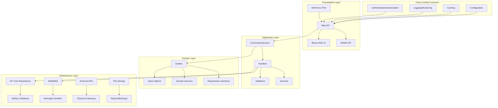
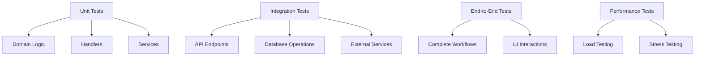
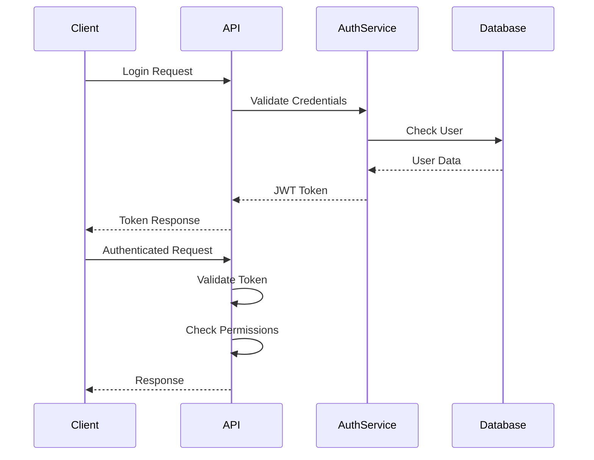

# Design Document

## Overview

Este documento apresenta o design detalhado para otimização e modernização do sistema PDV. O design foca em melhorar a arquitetura atual mantendo os benefícios do DDD e CQRS já implementados, enquanto adiciona funcionalidades essenciais e corrige problemas identificados.

A abordagem será incremental, preservando a funcionalidade existente enquanto implementa melhorias graduais. O sistema manterá a arquitetura em camadas atual (Domain, Infrastructure, API, Presentation) mas com melhor organização e separação de responsabilidades.

## Architecture

### Current Architecture Analysis

**Pontos Positivos Identificados:**
- Uso do .NET 8 (versão atual)
- Implementação de DDD com entidades bem definidas
- CQRS com MediatR para separação de comandos e queries
- Entity Framework Core com MySQL
- RabbitMQ para mensageria assíncrona
- Estrutura de testes iniciada

**Problemas Identificados:**
- Falta de autenticação e autorização
- Ausência de tratamento global de exceções
- Logging básico sem estruturação adequada
- Falta de validação de entrada robusta
- Falta de otimizações de performance
- Testes limitados
- Falta de configuração por ambiente
- Interface desktop desatualizada (WinForms)

### Improved Architecture



## Components and Interfaces

### 1. Authentication & Authorization

**Components:**
- `IAuthenticationService`: Interface para autenticação
- `IJwtTokenService`: Geração e validação de tokens JWT
- `IPermissionService`: Verificação de permissões
- `AuthenticationMiddleware`: Middleware para autenticação automática

**Implementation:**
```csharp
public interface IAuthenticationService
{
    Task<AuthResult> AuthenticateAsync(LoginRequest request);
    Task<AuthResult> RefreshTokenAsync(string refreshToken);
    Task RevokeTokenAsync(string token);
}

public interface IPermissionService
{
    Task<bool> HasPermissionAsync(Guid userId, string permission);
    Task<IEnumerable<string>> GetUserPermissionsAsync(Guid userId);
}
```

### 2. Global Exception Handling

**Components:**
- `GlobalExceptionMiddleware`: Captura todas as exceções
- `IExceptionHandler`: Interface para handlers específicos
- `BusinessExceptionHandler`: Trata exceções de negócio
- `ValidationExceptionHandler`: Trata erros de validação

### 3. Enhanced Validation

**Components:**
- `FluentValidation` para validações robustas
- `ValidationBehavior<TRequest, TResponse>`: Pipeline behavior para MediatR
- Custom validators para regras de negócio específicas

### 4. Enhanced Logging

**Components:**
- Structured logging com Serilog
- `IApplicationLogger`: Interface customizada
- Log enrichers para contexto adicional
- Correlation IDs para rastreamento

### 6. Performance Optimizations

**Components:**
- Async/await em todas operações I/O
- Paginação automática para listagens
- Query optimization com EF Core
- Background services para operações pesadas

### 7. Reporting System

**Components:**
- `IReportService`: Interface para geração de relatórios
- `PdfReportGenerator`: Geração de PDFs
- `ExcelReportGenerator`: Geração de planilhas
- `ReportTemplateEngine`: Engine para templates

### 8. Backup & Recovery

**Components:**
- `IBackupService`: Interface para backup
- `DatabaseBackupService`: Backup do banco de dados
- `FileBackupService`: Backup de arquivos
- `BackgroundBackupService`: Serviço em background

## Data Models

### Enhanced Entity Base

```csharp
public abstract class EntityBase : IAuditableEntity
{
    protected EntityBase()
    {
        Id = Guid.NewGuid();
        CreatedAt = DateTime.UtcNow;
    }

    public Guid Id { get; set; }
    public DateTime CreatedAt { get; set; }
    public DateTime? UpdatedAt { get; set; }
    public Guid? CreatedBy { get; set; }
    public Guid? UpdatedBy { get; set; }
    public bool IsDeleted { get; set; }
    public DateTime? DeletedAt { get; set; }
    public Guid? DeletedBy { get; set; }
}
```

### New Entities

**User Management:**
```csharp
public class User : EntityBase
{
    public string Username { get; set; }
    public string Email { get; set; }
    public string PasswordHash { get; set; }
    public bool IsActive { get; set; }
    public DateTime? LastLoginAt { get; set; }
    public ICollection<UserRole> UserRoles { get; set; }
}

public class Role : EntityBase
{
    public string Name { get; set; }
    public string Description { get; set; }
    public ICollection<RolePermission> RolePermissions { get; set; }
}

public class Permission : EntityBase
{
    public string Name { get; set; }
    public string Description { get; set; }
    public string Resource { get; set; }
    public string Action { get; set; }
}
```

**Audit Trail:**
```csharp
public class AuditLog : EntityBase
{
    public string EntityName { get; set; }
    public Guid EntityId { get; set; }
    public string Action { get; set; }
    public string Changes { get; set; }
    public Guid UserId { get; set; }
    public DateTime Timestamp { get; set; }
}
```

**Enhanced Product with Inventory Tracking:**
```csharp
public class Product : EntityBase
{
    // Existing properties...
    
    public decimal MinimumStock { get; set; }
    public decimal MaximumStock { get; set; }
    public decimal ReorderPoint { get; set; }
    public string Location { get; set; }
    public ICollection<StockMovement> StockMovements { get; set; }
}

public class StockMovement : EntityBase
{
    public Guid ProductId { get; set; }
    public Product Product { get; set; }
    public decimal Quantity { get; set; }
    public StockMovementType Type { get; set; }
    public string Reason { get; set; }
    public decimal UnitCost { get; set; }
}
```

## Error Handling

### Exception Hierarchy

```csharp
public abstract class BusinessException : Exception
{
    protected BusinessException(string message) : base(message) { }
    protected BusinessException(string message, Exception innerException) 
        : base(message, innerException) { }
}

public class ValidationException : BusinessException
{
    public ValidationException(string message) : base(message) { }
    public ValidationException(IEnumerable<ValidationFailure> failures) 
        : base(BuildErrorMessage(failures))
    {
        Failures = failures;
    }
    
    public IEnumerable<ValidationFailure> Failures { get; }
}

public class NotFoundException : BusinessException
{
    public NotFoundException(string entityName, object key) 
        : base($"{entityName} with key {key} was not found") { }
}

public class DuplicateException : BusinessException
{
    public DuplicateException(string message) : base(message) { }
}
```

### Global Exception Middleware

```csharp
public class GlobalExceptionMiddleware
{
    public async Task InvokeAsync(HttpContext context, RequestDelegate next)
    {
        try
        {
            await next(context);
        }
        catch (Exception ex)
        {
            await HandleExceptionAsync(context, ex);
        }
    }

    private async Task HandleExceptionAsync(HttpContext context, Exception exception)
    {
        var response = exception switch
        {
            ValidationException validationEx => new ErrorResponse
            {
                StatusCode = 400,
                Message = "Validation failed",
                Details = validationEx.Failures.Select(f => f.ErrorMessage)
            },
            NotFoundException notFoundEx => new ErrorResponse
            {
                StatusCode = 404,
                Message = notFoundEx.Message
            },
            BusinessException businessEx => new ErrorResponse
            {
                StatusCode = 400,
                Message = businessEx.Message
            },
            _ => new ErrorResponse
            {
                StatusCode = 500,
                Message = "An internal server error occurred"
            }
        };

        context.Response.StatusCode = response.StatusCode;
        await context.Response.WriteAsync(JsonSerializer.Serialize(response));
    }
}
```

## Testing Strategy

### Test Architecture



### Test Categories

**Unit Tests:**
- Domain entities and value objects
- Command/Query handlers
- Business services
- Validators

**Integration Tests:**
- Repository implementations
- API controllers
- Database migrations
- Message handlers

**End-to-End Tests:**
- Complete sale workflow
- User authentication flow
- Report generation
- Backup/restore operations

### Test Infrastructure

```csharp
public class TestFixture : IDisposable
{
    public IServiceProvider ServiceProvider { get; private set; }
    public TestDatabase Database { get; private set; }
    
    public TestFixture()
    {
        var services = new ServiceCollection();
        ConfigureServices(services);
        ServiceProvider = services.BuildServiceProvider();
        Database = ServiceProvider.GetRequiredService<TestDatabase>();
    }
}

public class IntegrationTestBase : IClassFixture<TestFixture>
{
    protected readonly TestFixture Fixture;
    protected readonly IMediator Mediator;
    
    public IntegrationTestBase(TestFixture fixture)
    {
        Fixture = fixture;
        Mediator = fixture.ServiceProvider.GetRequiredService<IMediator>();
    }
}
```

## Security Implementation

### Authentication Flow



### Authorization Strategy

- Role-based access control (RBAC)
- Permission-based granular control
- Resource-level authorization
- JWT tokens with refresh mechanism

### Security Headers

```csharp
public void Configure(IApplicationBuilder app)
{
    app.UseSecurityHeaders(policies =>
        policies
            .AddFrameOptionsDeny()
            .AddXssProtectionBlock()
            .AddContentTypeOptionsNoSniff()
            .AddReferrerPolicyStrictOriginWhenCrossOrigin()
            .AddCrossOriginEmbedderPolicy(builder => builder.RequireCorp())
            .AddCrossOriginOpenerPolicy(builder => builder.SameOrigin())
            .AddCrossOriginResourcePolicy(builder => builder.CrossOrigin())
    );
}
```

## Performance Optimizations

### Database Optimizations

1. **Query Optimization:**
   - Use of proper indexes
   - Query splitting for complex joins
   - Projection to DTOs instead of full entities
   - Bulk operations for large datasets

2. **Connection Management:**
   - Connection pooling configuration
   - Async operations throughout
   - Proper disposal of resources

3. **Performance Strategy:**
   - Optimized data access for frequently accessed data
   - Efficient query patterns for scalability
   - Data validation strategies

### API Optimizations

1. **Response Compression:**
   ```csharp
   services.AddResponseCompression(options =>
   {
       options.EnableForHttps = true;
       options.Providers.Add<GzipCompressionProvider>();
   });
   ```

2. **Pagination:**
   ```csharp
   public class PagedResult<T>
   {
       public IEnumerable<T> Items { get; set; }
       public int TotalCount { get; set; }
       public int PageNumber { get; set; }
       public int PageSize { get; set; }
       public int TotalPages => (int)Math.Ceiling((double)TotalCount / PageSize);
   }
   ```

3. **Async Operations:**
   - All I/O operations use async/await
   - Background services for heavy operations
   - Cancellation token support

## Monitoring and Observability

### Logging Strategy

```csharp
public static class LoggerExtensions
{
    public static void LogUserAction(this ILogger logger, string action, Guid userId, object data = null)
    {
        logger.LogInformation("User {UserId} performed {Action} with data {@Data}", 
            userId, action, data);
    }
    
    public static void LogBusinessEvent(this ILogger logger, string eventName, object data)
    {
        logger.LogInformation("Business event {EventName} occurred with data {@Data}", 
            eventName, data);
    }
}
```

### Health Checks

```csharp
services.AddHealthChecks()
    .AddDbContextCheck<PdvContext>()
    .AddRabbitMQ(connectionString)
    .AddCheck<ExternalApiHealthCheck>("external-api")
    .AddCheck<DiskSpaceHealthCheck>("disk-space");
```

### Metrics Collection

- Application metrics (requests/second, response times)
- Business metrics (sales volume, inventory levels)
- System metrics (CPU, memory, disk usage)
- Custom metrics for specific business events

## Deployment and Configuration

### Environment Configuration

```json
{
  "ConnectionStrings": {
    "DefaultConnection": "Server=localhost;Database=PDV;Uid=user;Pwd=password;"
  },
  "Authentication": {
    "JwtSecret": "your-secret-key",
    "TokenExpirationMinutes": 60,
    "RefreshTokenExpirationDays": 7
  },
  "Performance": {
    "DefaultTimeoutMinutes": 30,
    "QueryTimeoutMinutes": 10
  },
  "RabbitMQ": {
    "HostName": "localhost",
    "UserName": "guest",
    "Password": "guest",
    "VirtualHost": "/"
  },
  "Logging": {
    "LogLevel": {
      "Default": "Information",
      "Microsoft": "Warning"
    }
  }
}
```

### Docker Support

```dockerfile
FROM mcr.microsoft.com/dotnet/aspnet:8.0 AS base
WORKDIR /app
EXPOSE 80
EXPOSE 443

FROM mcr.microsoft.com/dotnet/sdk:8.0 AS build
WORKDIR /src
COPY ["*.csproj", "./"]
RUN dotnet restore
COPY . .
RUN dotnet build -c Release -o /app/build

FROM build AS publish
RUN dotnet publish -c Release -o /app/publish

FROM base AS final
WORKDIR /app
COPY --from=publish /app/publish .
ENTRYPOINT ["dotnet", "Sis-Pdv-Controle-Estoque-API.dll"]
```

## Migration Strategy

### Phase 1: Foundation
- Implement authentication and authorization
- Add global exception handling
- Enhance logging and monitoring
- Improve validation

### Phase 2: Core Features
- Add user management
- Implement audit trail
- Enhance inventory management
- Add reporting system

### Phase 3: Advanced Features
- Implement caching
- Add backup/recovery
- Performance optimizations
- Enhanced UI

### Phase 4: Integration & Scaling
- External integrations
- Mobile support
- Advanced analytics
- Scalability improvements

Each phase will be implemented incrementally with proper testing and validation before moving to the next phase.