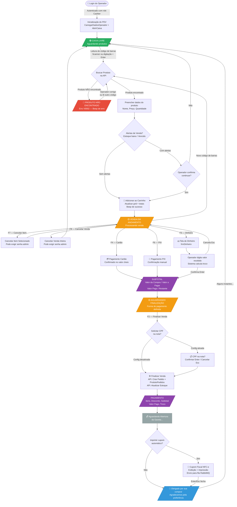
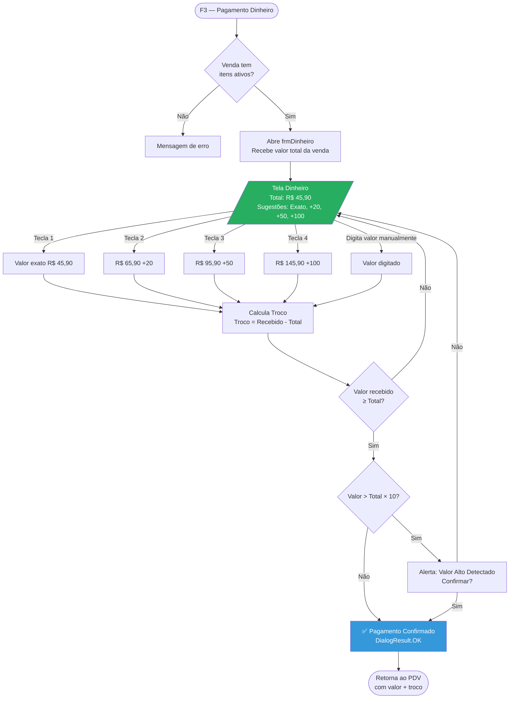
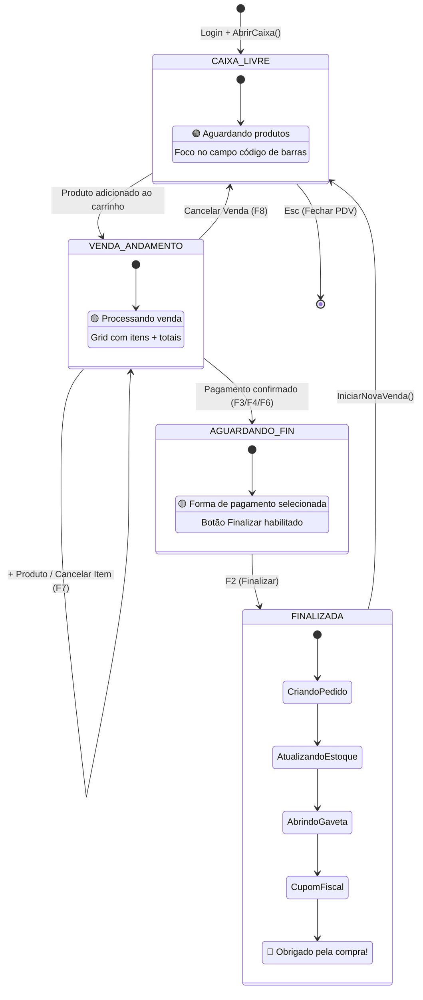
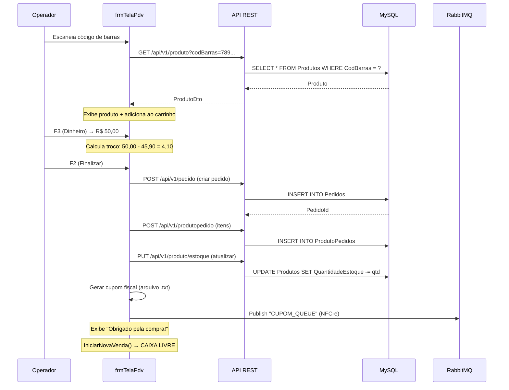

# Fluxo Completo do PDV — Ponto de Venda

> Documento de referência para o fluxo operacional do sistema de frente de caixa (WinForms).
> Baseado na análise do código-fonte e prints das telas reais.

---

## Diagrama de Fluxo Geral

---

## Diagrama de Fluxo — Pagamento em Dinheiro (Detalhe)

---

## Passo a Passo Detalhado

### Passo 1 — Login do Operador

| Item | Detalhe |
|------|---------|
| **Tela** | `frmLogin` — campos de usuário e senha |
| **Ação** | Operador digita credenciais e pressiona **Enter** |
| **Backend** | `AuthApiService.LoginAsync()` → recebe JWT token |
| **Roteamento** | Role `Cashier` / `CashSupervisor` → abre direto o PDV |
| **Arquivo** | `Paginas/Login/frmLogin.cs` |

---

### Passo 2 — Inicialização do PDV (Tela "CAIXA LIVRE")

| Item | Detalhe |
|------|---------|
| **Tela** | Tela principal do PDV com fundo gradiente turquesa→roxo |
| **Estado** | Label **"CAIXA LIVRE"** centralizado na tela |
| **Barra inferior** | LOJA: nome da loja · CAIXA: número · Série · HOMOLOGAÇÃO · OPERADOR: nome · Versão |
| **Ações automáticas** | `CarregarDadosOperador()`, `AbrirCaixa()`, `IniciarNovaVenda()` |
| **Próximo** | Foco automático no campo de código de barras |
| **Arquivo** | `Paginas/PDV/frmTelaPdv.cs` → `frmTelaPdv_Load()` |

> **Print de referência:** Tela com "CAIXA LIVRE" no centro inferior da tela gradiente.

---

### Passo 3 — Leitura do Código de Barras

| Item | Detalhe |
|------|---------|
| **Tela** | Painel esquerdo aparece com campo de código de barras no topo |
| **Scanner** | Caracteres chegam a < 80ms de intervalo → detecção automática (≥ 5 caracteres) |
| **Manual** | Operador digita código e pressiona **Enter** |
| **Busca** | `ProdutoService.ListarProdutoPorCodBarras(codigo)` via API |
| **Arquivo** | `frmTelaPdv.cs` → `ProcessarCodigoBarras()` |

---

### Passo 4a — Produto Encontrado

| Item | Detalhe |
|------|---------|
| **Tela** | Painel esquerdo: QUANTIDADE (1,000), VALOR UNITÁRIO (45,90), TOTAL ITEM (45,90) |
| **NFC-e** | Painel direito mostra: "001 - 7891234567890 - TUBO SOLDAVEL PB 6M" / "1,000 CDA 45,90" |
| **Carrinho** | Ícone 🛒 com total R$ 45,90 no canto inferior direito |
| **Status bar** | "1,000 CDA X TUBO SOLDAVEL PB 6M" (barra preta inferior) |
| **Som** | `SystemSounds.Beep` — confirmação |
| **Próximo** | Campo de código de barras limpo, pronto para próximo item |

> **Print de referência:** Tela com produto TUBO SOLDAVEL PB 6M exibido nos painéis.

---

### Passo 4b — Produto NÃO Encontrado

| Item | Detalhe |
|------|---------|
| **Tela** | MessageBox "Erro: V0002" com ícone ⚠️ e mensagem "Produto não encontrado" |
| **Status bar** | "PRODUTO NÃO ENCONTRADO" (barra preta inferior) |
| **Painéis** | QUANTIDADE mantém valor, VALOR UNITÁRIO e TOTAL ITEM ficam vazios |
| **Som** | `SystemSounds.Hand` — beep de erro |
| **Próximo** | Código de barras selecionado no campo para correção ou nova digitação |
| **Arquivo** | `frmTelaPdv.cs` → trecho de `produto == null` em `ProcessarCodigoBarras()` |

> **Print de referência:** Dialog "Erro:V0002 — Produto não encontrado" com botão OK.

---

### Passo 5 — CPF na Nota (Primeiro Produto)

| Item | Detalhe |
|------|---------|
| **Tela** | Dialog centralizado: **"CPF na nota?"** / "(Digite o CPF)" |
| **Botões** | **Confirmar [Enter]** (verde) · **Cancelar [Esc]** (vermelho) |
| **Condição** | Aparece quando `ConfiguracaoPdvDto.SolicitarCpfCliente = true` |
| **Se confirmar** | CPF é armazenado em `VendaAtual.CpfCnpjCliente` para o cupom fiscal |
| **Se cancelar** | Venda prossegue sem CPF na nota |
| **Obs.** | No código atual, `SolicitarCpfCliente()` é um stub (TODO) — retorna `""` |

> **Print de referência:** Tela com dialog "CPF na nota?" com botões verde e vermelho.

---

### Passo 6 — Venda em Andamento (Adicionando Mais Itens)

| Item | Detalhe |
|------|---------|
| **Estado** | `StatusVenda = "ABERTA"` com itens no carrinho |
| **Label** | "PROCESSANDO VENDA" (amarelo) |
| **Ações** | Operador pode: escanear mais produtos, cancelar itens (F7), cancelar venda (F8) |
| **Grid** | `DataGridView` mostra todos os itens com código, descrição, qtd, valor, total |
| **Itens cancelados** | Aparecem em vermelho com tachado no grid |

---

### Passo 7 — Pagamento (F3 = Dinheiro)

| Item | Detalhe |
|------|---------|
| **Tela** | `frmDinheiro` modal — exibe total e campo para valor recebido |
| **Atalhos** | 1 = valor exato · 2 = +R$20 · 3 = +R$50 · 4 = +R$100 |
| **Cálculo** | `Troco = ValorRecebido - TotalVenda` |
| **Validação** | Recebido ≥ Total (obrigatório) · Detecta valores muito altos (> 10× total) |
| **Confirma** | **Enter** → `ProcessarConfirmacao()` → `DialogResult.OK` |
| **Cancela** | **Esc** → retorna ao PDV sem pagamento |
| **Arquivo** | `Paginas/Dinheiro/frmDinheiro.cs` |

---

### Passo 8 — Subtotal / Aguardando Finalização

| Item | Detalhe |
|------|---------|
| **Tela** | Painel esquerdo muda para **SUBTOTAL** com campos: |
| | • VALOR DA COMPRA: R$ 45,90 |
| | • VALOR A PAGAR: R$ 45,90 · VALOR PAGO: R$ 0,00 |
| | • RESTANTE: R$ 45,90 |
| | • Campo de forma de pagamento (ícone 💳) |
| **Estado** | "AGUARDANDO FINALIZAÇÃO" (amarelo) |
| **Próximo** | Operador pressiona **F2** para finalizar |

> **Print de referência:** Tela SUBTOTAL com valores e área de forma de pagamento.

---

### Passo 9 — Finalização e Pagamento

| Item | Detalhe |
|------|---------|
| **Trigger** | **F2** — `FinalizarVendas()` |
| **Tela** | Painel esquerdo muda para **PAGAMENTO** com: |
| | • ITENS: 1 · DESCONTO: 0,00 |
| | • SUBTOTAL: R$ 45,90 |
| | • VALOR PAGO: R$ 50,00 |
| | • TROCO: R$ 4,10 |
| **NFC-e** | Painel direito adiciona: "DINHEIRO: 50,00" |
| **API** | Cria `Pedido` + `ProdutoPedido` para cada item + atualiza estoque |
| **Status bar** | "AGUARDANDO ABERTURA DA GAVETA..." |
| **Loading** | Spinner circular azul enquanto processa |

> **Print de referência:** Tela PAGAMENTO com troco R$ 4,10 e spinner de loading.

---

### Passo 10 — Cupom Fiscal (NFC-e)

| Item | Detalhe |
|------|---------|
| **Tela** | `frmCupom` modal — exibe cupom formatado em lista |
| **Geração** | Arquivo texto em `C:\Recibos\{pedidoId}.txt` |
| **Conteúdo** | Cabeçalho empresa, CNPJ, CPF cliente, itens, totais, forma de pagamento, troco |
| **RabbitMQ** | Envia para fila `"CUPOM_QUEUE"` (assíncrono, falha não bloqueia) |
| **Atalhos** | Enter/Esc = fecha · P/F2 = imprime · S/F3 = salva PDF |
| **Condição** | Aparece quando `ConfiguracaoPdvDto.ImprimirCupomAutomatico = true` |
| **Arquivo** | `Paginas/Cupom/frmCupom.cs` |

---

### Passo 11 — Tela "Obrigado pela Compra!"

| Item | Detalhe |
|------|---------|
| **Tela** | Dialog centralizado com ícone de sacola de compras ✅ |
| **Texto** | **"Obrigado por sua compra!"** / "Agradecemos pela preferência, volte sempre!" |
| **Botão** | "Obrigado por comprar conosco!" (azul) |
| **Duração** | Exibido por alguns instantes antes de retornar ao estado CAIXA LIVRE |
| **Som** | `SystemSounds.Asterisk` — som de sucesso |

> **Print de referência:** Tela com sacola de compras e mensagem de agradecimento.

---

### Passo 12 — Retorno ao "CAIXA LIVRE"

| Item | Detalhe |
|------|---------|
| **Ação** | `IniciarNovaVenda()` — cria novo `VendaDto` com status "ABERTA" |
| **Limpeza** | Carrinho zerado, campos de produto limpos, totais em R$ 0,00 |
| **Label** | "CAIXA LIVRE - Aguardando produtos" (verde) |
| **Foco** | Campo de código de barras recebe foco automático |
| **Ciclo** | Sistema volta ao **Passo 3**, pronto para nova venda |

---

## Mapa de Atalhos de Teclado

### Tela Principal do PDV (`frmTelaPdv`)

| Tecla | Ação | Quando disponível |
|-------|------|-------------------|
| **Enter** | Buscar produto pelo código digitado | Sempre (no campo de código de barras) |
| **F1** | Exibir ajuda | Sempre |
| **F2** | Finalizar venda | Após definir forma de pagamento |
| **F3** | Pagamento em dinheiro | Com itens no carrinho |
| **F4** | Pagamento em cartão | Com itens no carrinho |
| **F5** | Limpar campos do produto | Sempre |
| **F6** | Pagamento via PIX | Com itens no carrinho |
| **F7** | Cancelar item selecionado | Com itens no carrinho |
| **F8** | Cancelar venda inteira | Com itens no carrinho |
| **Esc** | Fechar PDV (com confirmação) | Sempre |

### Tela de Dinheiro (`frmDinheiro`)

| Tecla | Ação |
|-------|------|
| **Enter** | Confirmar pagamento |
| **Esc** | Cancelar e voltar |
| **1** | Sugestão: valor exato |
| **2** | Sugestão: +R$ 20 |
| **3** | Sugestão: +R$ 50 |
| **4** | Sugestão: +R$ 100 |
| **F1** | Ajuda |

### Cupom Fiscal (`frmCupom`)

| Tecla | Ação |
|-------|------|
| **Enter / Esc** | Fechar cupom |
| **P / F2** | Imprimir cupom físico |
| **S / F3** | Salvar como arquivo |
| **F1** | Ajuda |

---

## Estados do PDV

---

## Fluxo de Comunicação com APIs

---

## Tratamento de Erros

| Cenário | Comportamento | Tela |
|---------|---------------|------|
| Produto não encontrado | Label vermelha "NÃO ENCONTRADO" + beep de erro + dialog V0002 | Sem bloqueio — campo pronto para nova entrada |
| Estoque insuficiente | Alerta com confirmação (Sim/Não) | Continua ou cancela adição |
| Produto vencido | Alerta com confirmação (Sim/Não) | Continua ou cancela adição |
| Valor pago insuficiente | Não permite confirmar pagamento | Permanece na tela frmDinheiro |
| Valor muito alto (>10× total) | Alerta "Valor Alto Detectado" com confirmação | Confirma ou corrige |
| Venda sem itens | Impede pagamento e finalização | Mensagem de erro |
| Sem forma de pagamento | Impede finalização (F2 desabilitado) | Mensagem de erro |
| Falha na API | MessageBox com erro + log | Operação não concluída |
| Falha no RabbitMQ | Silenciosa — não bloqueia a venda | Cupom não enviado para fila |
| Cancelar item/venda | Pode exigir login de administrador | Dialog frmVerificaLogin |

---

## Arquivos de Código Relacionados

| Arquivo | Responsabilidade |
|---------|-----------------|
| `Paginas/Login/frmLogin.cs` | Autenticação e roteamento por role |
| `Paginas/Login/frmVerificaLogin.cs` | Autenticação admin para operações sensíveis |
| `Paginas/PDV/frmTelaPdv.cs` | Tela principal do PDV (1680 linhas) |
| `Paginas/PDV/frmCancelarItem.cs` | Dialog para cancelar item específico |
| `Paginas/Dinheiro/frmDinheiro.cs` | Tela de pagamento em dinheiro (795 linhas) |
| `Paginas/Cupom/frmCupom.cs` | Geração e exibição do cupom fiscal (794 linhas) |
| `Services/PdvManager.cs` | Gerenciamento de estado da venda |
| `Services/ProdutoService.cs` | Comunicação com API de produtos |
| `Services/PedidoService.cs` | Comunicação com API de pedidos |

---

*Última atualização: Fevereiro 2026*
