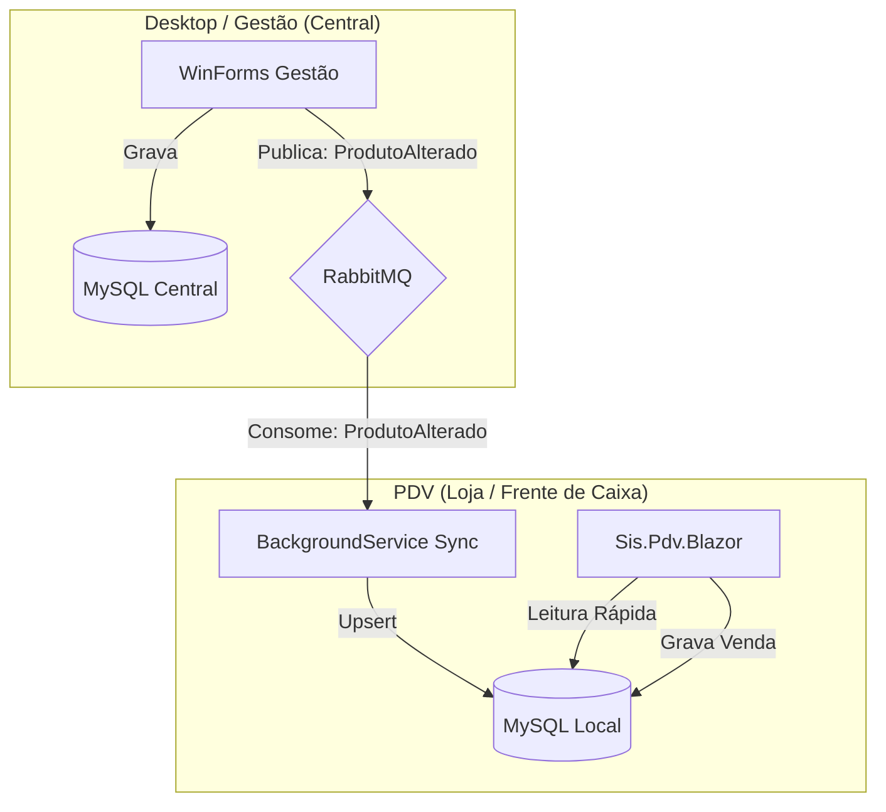

# Plano de Implementação PDV — Arquitetura Offline-First (Blazor + RabbitMQ)

Este documento define o roteiro para a construção do novo PDV em Blazor Server, operando de forma autônoma (offline) com banco de dados local e sincronização via RabbitMQ com o sistema de gestão central.

## 🏗️ Arquitetura do Sistema



## 📋 Status do Projeto

| Fase | Descrição | Status | Estimativa |
| :--- | :--- | :--- | :--- |
| **0** | **Base do Projeto** | ✅ **Concluído** | --- |
| **1** | **Infraestrutura de Dados (Offline)** | 🔄 **Em Progresso** | 4-5h |
| **2** | **Sincronização (RabbitMQ)** | ✅ **Concluído** | 4-5h |
| **3** | **Login & Autenticação Offline** | ✅ **Concluído** | 3-4h |
| **4** | **Core do PDV (MVVM + Estados)** | ✅ **Concluído** | 5-6h |
| **5** | **Interface de Venda (UI)** | ✅ **Concluído** | 4-5h |
| **6** | **Fluxo de Pagamento** | ✅ **Concluído** | 4-5h |
| **7** | **Finalização & Cupom** | ✅ **Concluído** | 3-4h |
| **8** | **Testes e Polimento** | ⏳ Pendente | 4-5h |

---

## 📅 Detalhamento das Fases

### Fase 1: Infraestrutura de Dados (Offline) ✅
Configuração do acesso a dados local usando Entity Framework Core e MySQL. Definição das tabelas que garantem o funcionamento desconectado.

- [x] Instalar EF Core e MySql Packages
- [x] Implementar `PdvDbContext` (Produtos, Vendas, Itens, Usuarios)
- [x] Criar Migrations iniciais e aplicar
- [x] Implementar `ProdutoRepository` (Leitura otimizada Local)
- [x] Implementar `VendaRepository` (Escrita Local)
- [x] Configurar injeção de dependência dos repositórios locais

### Fase 2: Sincronização e Mensageria (RabbitMQ + MassTransit) ✅
Implementação da arquitetura orientada a eventos (EDA) para garantir consistência entre API e PDV sem acoplamento temporal.

**No PDV (Blazor):**
- [x] Configurar **MassTransit** com RabbitMQ
- [x] Criar Consumers: `ProdutoAlteradoConsumer`
- [x] BackgroundService para envio de vendas (`SalesUploaderWorker` - esqueleto)

**Na API (Backend Existente):**
- [x] Configurar **MassTransit** (Concluído)
- [x] Refatorar Services/CommandHandlers para publicar eventos
- [x] Criar Consumer: `VendaRealizadaConsumer` (para receber vendas do PDV)

**Contratos (Shared Kernel):**
- [x] Definir events (`ProdutoAlteradoEvent`) no projeto Blazor (temporariamente, ideal mover para shared).

### Fase 3: Login & Autenticação Offline (DDD) ✅
O PDV deve permitir login offline, validando hash localmente.
*(Adiado para priorizar fluxo de venda - hardcoded user por enquanto)*

- [x] **Domain**: Entidade `UsuarioLocal` (Aggregate Root)
- [x] **Infra**: Repositório `UsuarioRepository` com EF Core (via DbContext/DbSet)
- [x] **Service**: `AuthService` com estratégia *Chain of Responsibility* (Tenta Online -> Fallback Offline)

### Fase 4: Core do PDV (MVVM) ✅
Adaptação do ViewModel para lógica totalmente desconectada.

- [x] Refatorar `PdvViewModel` para usar `IProdutoRepository` (Local)
- [x] Refatorar `PdvViewModel` para salvar via `IVendaRepository` (Local)
- [x] Lógica de persistência offline (VendaEntity/ItemVendaEntity)
- [x] Tratamento de estados (Caixa Livre, Venda, Pagamento, Finalizada)

### Fase 5: Interface de Venda (UI) ✅
Construção da tela amigável e responsiva com atalhos de teclado.

- [x] Painel de Caixa Livre (Loop de atração)
- [x] Painel de Venda (Lista de itens, totais)
- [x] Painel lateral (NFC-e visualização)
- [x] **Atalhos de Teclado (JSKeys/JSInterop)**:
    - [x] Integrar `JSKeys` e `JSKeysConverter`
    - [x] Criar serviço de escuta global de teclas (`KeyboardService`)
    - [x] Mapear F1 (Ajuda), F5 (Buscar), F12 (Pagamento), Esc (Cancelar), Delete (Remover Item)
- [x] Componentes Blazor reativos ao ViewModel

### Fase 6: Fluxo de Pagamento ✅
Registro das formas de pagamento e cálculo de troco.

- [x] Dialog de Pagamento (Dinheiro, Cartão, PIX)
- [x] Validação de valores e descontos
- [x] Persistência da Venda completa no MySQL Local (Já implementado na Fase 4)
- [x] Integração com atalhos de confirmação (Enter no pagamento)

### Fase 7: Sincronização de Volta (Upload) ✅
Enviar as vendas realizadas no PDV para o servidor central quando houver conexão.

- [x] Tabela `Vendas` com flag `Sincronizada = false`
- [x] Worker de Upload (`SalesUploaderService`)
- [x] Envio via RabbitMQ ou API para o Central
- [x] Marcação de vendas sincronizadas

### Fase 8: Containerização e Deploy (Docker) 🐳
Definição exata de onde cada processo roda para garantir isolamento e acesso às filas.

**Topologia de Containers:**
1.  **Container PDV (`pdv-app`)**:
    - Roda o Blazor Server (Porta 80/443 do totem)
    - Roda o `SyncWorker` (BackgroundService) internamente
    - Roda o `SalesUploaderWorker` (BackgroundService) internamente
    - Conecta no MySQL Local (`pdv-db`) e RabbitMQ Central (`rabbitmq`)

2.  **Container Banco Local (`pdv-db`)**:
    - MySQL 8.0 exclusivo do PDV
    - Volume persistente local no Host

3.  **Container API (`api-backend`)** (Já existente):
    - Roda a API e também os Consumers de Venda do MassTransit
    - Conecta no MySQL Central

**Networking:**
- O PDV deve acessar o RabbitMQ na rede da loja (ou via VPN/Tunnel se remoto)
- O MySQL Local é acessível APENAS pelo container PDV (segurança)

### Fase 9: Finalização & Testes
- [ ] Teste de queda de rede (Offline Mode)
- [ ] Teste de carga (10.000 produtos locais)
- [ ] Impressão de Comprovante (Integração impressora)

## 📦 Estrutura de Pastas (Revisada)

```
Sis.Pdv.Blazor/
├── Components/         # UI (Pages, Layouts)
├── Configuration/      # Configs (RabbitMQ, Loja)
├── Data/
│   ├── Entities/       # Tabelas (Produto, Venda, Usuario)
│   ├── Migrations/     # MySQL Migrations
│   └── PdvDbContext.cs
├── Messaging/          # RabbitMQ
│   ├── Consumers/      # Listeners (ProdutoUpdate)
│   └── Events/         # Contratos (DTOs de fila)
├── Repositories/       # Acesso a Dados (Local)
├── Services/           # Lógica de Negócio / Background
└── ViewModels/         # Estado das Telas
```
